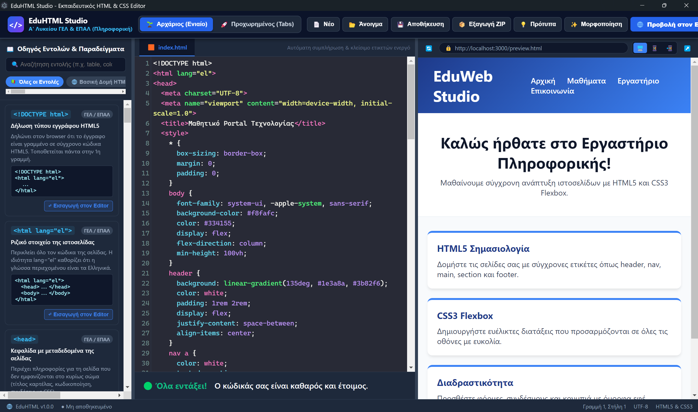

# EduHTML Studio 🎓 (Windows 11 Edition)

**Εκπαιδευτικός HTML5 & CSS3 Editor με Ενσωματωμένο Browser για την Α' Λυκείου (ΓΕΛ) & τον Τομέα Πληροφορικής των ΕΠΑΛ**

[](https://creativecommons.org/licenses/by-nc/4.0/)
[](https://www.microsoft.com/windows)
[](https://www.electronjs.org/)

> **Δημιουργός:** **Λέων Προκόπης**, Καθηγητής Πληροφορικής ΠΕ86, 2ο ΓΕΛ Ναυπλίου  
> **Σχεδιασμένο & Βελτιστοποιημένο:** Αποκλειστικά για περιβάλλοντα Windows 11 σχολικών εργαστηρίων και οικιακών υπολογιστών.

---

## 📸 Προεπισκόπηση Εφαρμογής



---

## 📖 Περιγραφή & Σκοπός

Το **EduHTML Studio** αναπτύχθηκε για να καλύψει τις ανάγκες διδασκαλίας και εργαστηριακής εξάσκησης των μαθητών της Δευτεροβάθμιας Εκπαίδευσης:
- **Α' Τάξη Γενικού Λυκείου (ΓΕΛ):** Μάθημα «Εφαρμογές Πληροφορικής» (Εισαγωγή στις γλώσσες σήμανσης HTML5).
- **Τομέας Πληροφορικής ΕΠΑΛ:** Ειδικότητες Πληροφορικής (Μαθήματα «Σχεδίαση & Ανάπτυξη Ιστοτόπων», HTML5, CSS3, Responsive Design).

Στόχος του λογισμικού είναι να παρέχει ένα **ολοκληρωμένο, εύχρηστο και ασφαλές offline περιβάλλον**, χωρίς περίπλοκες ρυθμίσεις ή απαιτήσεις δικτύου.

---

## ✨ Κύριες Δυνατότητες & Χαρακτηριστικά

### 1. 🪟 Ειδικές Βελτιστοποιήσεις για Windows 11
- **Ενσωμάτωση Microsoft Edge (`msedge.exe`):** Άμεση κλήση του προεγκατεστημένου Edge των Windows 11 για 100% πιστή προβολή.
- **Windows 11 Fluent UI & Styling:** Υποστήριξη Mica effect, σκοτεινού/φωτεινού θέματος, Windows Snap Layouts (`Win + Βέλη`) και σύγχρονων γραμματοσειρών (`Segoe UI Variable`, `Cascadia Code`).
- **Πλήρης Οθόνη & Ελαχιστοποίηση:** Ειδικό κουμπί πλήρους οθόνης (`⛶`) και συμβατότητα με τις γνωστές λειτουργίες παραθύρου των Windows 11.

### 2. 🌱 Διπλή Λειτουργία Εργασίας (Modes)
- **🌱 Λειτουργία Αρχάριος (Ενιαίο Αρχείο):** Ο μαθητής γράφει ένα ενιαίο `index.html` με ενσωματωμένο εσωτερικό CSS (`<style>...</style>`). Ιδανικό για τα πρώτα εισαγωγικά μαθήματα.
- **🚀 Λειτουργία Προχωρημένος (Multi-Tab):** Διαχωρισμένες καρτέλες για `index.html` και `style.css` με αυτόματη συνένωση κατά την εκτέλεση.
- **Προσαρμογή Διεπαφής:** Από τις Ρυθμίσεις (`⚙️`), ο καθηγητής μπορεί να αποκρύψει τα κουμπιά επιλογής λειτουργίας και τα πρότυπα, προσφέροντας μια υπεραπλουστευμένη οθόνη για αρχάριους μαθητές.

### 3. 💡 Έξυπνη Πρόταση Εντολών HTML & CSS (Autocomplete στυλ Notepad++)
- **Αυτόματη Εμφάνιση Προτάσεων:** Καθώς ο μαθητής ανοίγει ένα tag (πληκτρολογώντας `<`) ή ξεκινά τη δακτυλογράφηση, εμφανίζεται αυτόματα αναδυόμενο παράθυρο με καθαρά ονόματα ετικετών HTML5 (π.χ. `h1`, `p`, `a`, `table`, `img` κ.ά.) με το χαρακτηριστικό εικονίδιο του Notepad++.
- **Αυτόματο Κλείσιμο Ετικετών & Τοποθέτηση Κέρσορα:** Με την επιλογή οποιασδήποτε διπλής ετικέτας, τοποθετείται αυτόματα το ζεύγος (π.χ. `<h1></h1>`) και ο κέρσορας τοποθετείται αυτόματα στο κέντρο για άμεση πληκτρολόγηση.
- **Υποστήριξη CSS:** Στην καρτέλα `style.css` (ή στο εσωτερικό CSS), προτείνονται αυτόματα όλες οι ιδιότητες CSS (π.χ. `color`, `background-color`, `font-size`, `display` κ.ά.).
- **Συντόμευση Πληκτρολογίου:** Άμεση εμφάνιση προτάσεων ανά πάσα στιγμή με `Ctrl + Space` ή `Alt + Space`.

### 4. 🌐 Ενσωματωμένος & Εξωτερικός Browser
- **Live Preview:** Άμεση ανανέωση της ιστοσελίδας σε πραγματικό χρόνο καθώς πληκτρολογεί ο μαθητής.
- **Επιλογή Εξωτερικού Browser:** Δυνατότητα ορισμού του αγαπημένου browser από τις Ρυθμίσεις (**Edge**, **Chrome**, **Firefox**, **Brave** ή Windows Default). Το κουμπί προσαρμόζεται αυτόματα (π.χ. *«Προβολή στον Edge»*).
- **Σύνδεση με το e-Class (`🏫 e-Class`):** Άμεσο κουμπί για άνοιγμα της επίσημης πύλης **`https://eclass.sch.gr`** του Πανελλήνιου Σχολικού Δικτύου.

### 5. 📁 Οργάνωση Αρχείων & Αυτόματος Φάκελος
- **Αυτόματος Φάκελος `Documents/mywebpages`:** Στην πρώτη εκκίνηση δημιουργείται αυτόματα φάκελος στα Έγγραφα του χρήστη.
- **Άνοιγμα & Αποθήκευση:** Οι διάλογοι αρχείων ανοίγουν απευθείας στον προεπιλεγμένο φάκελο, διευκολύνοντας τους μαθητές στην εύρεση των εργασιών τους.
- **Δυνατότητα Αλλαγής:** Ο φάκελος αλλάζει ανά πάσα στιγμή μέσα από τις Ρυθμίσεις (`⚙️`).
- **Καθαρός Σκελετός στο «📄 Νέο»:** Το κουμπί «Νέο» παράγει έναν καθαρό βασικό σκελετό (`<!DOCTYPE html>`, `<html>`, `<head>`, `<title>`, `<body>`) χωρίς περιττά στοιχεία.

### 6. 📖 Διαδραστικός Οδηγός Εντολών (Cheat Sheet) στα Ελληνικά
- Πλήρης κατάλογος όλων των ετικετών HTML5, ιδιοτήτων CSS3 και βασικών εντολών JavaScript του αναλυτικού προγράμματος.
- Επεξηγήσεις στα απλά Ελληνικά, σύνταξη, έτοιμα παραδείγματα και ένδειξη επιπέδου (ΓΕΛ / ΕΠΑΛ).
- Κουμπί **«↵ Εισαγωγή στον Editor»** για αυτόματη εισαγωγή του κώδικα στο σημείο του κέρσορα.
- Ξεκινά κλειστός κατά την εκκίνηση και ανοίγει με το κουμπί **📚** ή τη συντόμευση `Ctrl + G`.

### 7. 🔍 Ενισχυμένος Εκπαιδευτικός Έλεγχος & Βοηθός Λαθών
- **Έλεγχος Ελληνικών Χαρακτήρων στα Tags:** Εντοπίζει άμεσα αν ένας μαθητής πληκτρολόγησε ετικέτα με ελληνικά (π.χ. `<τίτλος>`, `<δομή>`) και προειδοποιεί στα Ελληνικά.
- **Έλεγχος Ορθογραφίας Ετικετών:** Εντοπίζει τυπογραφικά λάθη (π.χ. `<tutle>`, `<basd>`) έναντι του επίσημου HTML5 προτύπου.
- **Έλεγχος Δομής & Ιεραρχίας:** Ελέγχει τη σωστή σειρά `<head>` και `<body>`, απαγορεύει κώδικα μετά το `</html>`, και επισημαίνει μη κλεισμένες ετικέτες.
- **Ευανάγνωστη Μπάρα:** Μεγάλη γραμματοσειρά (+4pt), δυνατότητα εμφάνισης δύο γραμμών μηνύματος και πλήρη επεξήγηση στο πέρασμα του ποντικιού (Mouseover Tooltip).

### 8. 📦 Έτοιμα Εκπαιδευτικά Πρότυπα (Starter Templates)
1. **Βασικός Σκελετός HTML5**
2. **Μορφοποίηση Κειμένου & Ποίημα**
3. **Αγαπημένοι Ιστότοποι & Λίστες**
4. **Εβδομαδιαίο Σχολικό Ωρολόγιο Πρόγραμμα (Πίνακες)**
5. **Φόρμα Εγγραφής Μαθητικού Ομίλου (Forms & Inputs)**
6. **Μοντέρνα Σελίδα με Μενού & Flexbox Layout**
7. **Διαδραστικός Μετρητής με JavaScript (Ορατό μόνο στη λειτουργία Προχωρημένος / ΕΠΑΛ)**
8. **Κουίζ Πολλαπλής Επιλογής με JavaScript (Ορατό μόνο στη λειτουργία Προχωρημένος / ΕΠΑΛ)**

### 8. 🛠️ Εργαλεία Παράδοσης Εργασιών
- **Εξαγωγή σε ZIP:** Συμπιέζει όλα τα αρχεία του μαθητή σε ένα αρχείο `.zip` έτοιμο για υποβολή στο e-class ή e-me.
- **Μορφοποίηση Κώδικα (Beautify):** Αυτόματη στοίχιση των ετικετών (2 διαστήματα) με το πάτημα ενός κουμπιού.
- **Μεγέθυνση (A- / A+):** Ιδανικό για προβολή στον διαδραστικό πίνακα του σχολικού εργαστηρίου.

---

## 🚀 Οδηγίες Εγκατάστασης & Εκτέλεσης

### Απαιτήσεις Συστήματος
- **Λειτουργικό Σύστημα:** Windows 11 (64-bit)
- **Node.js:** v18+ (για εκτέλεση από τον πηγαίο κώδικα)

### Εκτέλεση μέσω Git & Node.js:
```bash
# 1. Κλωνοποίηση του αποθετηρίου
git clone https://github.com/pliroforikos/myHTML.git

# 2. Μετάβαση στον φάκελο
cd myHTML

# 3. Εγκατάσταση εξαρτήσεων
npm install

# 4. Εκκίνηση της εφαρμογής
npm start
# Ή διπλό κλικ στο start.bat
```

### Δημιουργία Αυτόνομου Εκτελέσιμου (Portable .exe):
```bash
npm run dist
```
Το αρχείο `EduHTML Studio-Windows11-Portable.exe` θα παραχθεί στον φάκελο `dist/`.

---

## ⌨️ Συντομεύσεις Πληκτρολογίου

| Συντόμευση | Ενέργεια |
| :--- | :--- |
| `Ctrl + S` | Αποθήκευση τρέχοντος αρχείου |
| `Ctrl + O` | Άνοιγμα αρχείου από τον προεπιλεγμένο φάκελο |
| `Ctrl + B` | Προβολή στον επιλεγμένο Browser (π.χ. Edge) |
| `Ctrl + G` | Εμφάνιση / Απόκρυψη Οδηγού Εντολών |
| `F5` | Χειροκίνητη ανανέωση προεπισκόπησης |
| `F11` | Εναλλαγή πλήρους οθόνης |

---

## ⚖️ Άδεια Χρήσης (License)

Το λογισμικό διατίθεται υπό τους όρους της διεθνούς άδειας:  
**[Creative Commons Attribution-NonCommercial 4.0 International (CC BY-NC 4.0)](https://creativecommons.org/licenses/by-nc/4.0/)**

- **Ελεύθερη & Δωρεάν Χρήση:** Επιτρέπεται η χρήση, αναπαραγωγή και διανομή για εκπαιδευτικούς σκοπούς.
- **Υποχρεωτική Αναφορά Δημιουργού:** Απαιτείται αναφορά στον δημιουργό (**Λέων Προκόπης, Καθηγητής Πληροφορικής ΠΕ86, 2ο ΓΕΛ Ναυπλίου**).
- **Μη Εμπορική Χρήση:** Απαγορεύεται ρητά οποιαδήποτε μεταπώληση ή εμπορική εκμετάλλευση.

---
*Αναπτύχθηκε με μεράκι για τη Δημόσια Εκπαίδευση.*
